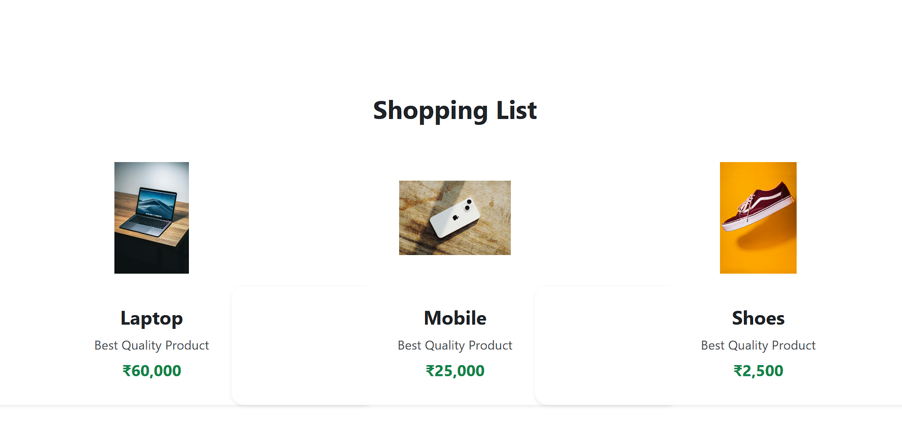

# 🛍️ Shopping List App (React)

A simple and responsive **Shopping List Application** built using **React JS**.  
This project displays a list of products with their **image, name, description, and price** in a clean card layout using Bootstrap styling.

---

## 🚀 Features

✅ Displays multiple shopping products  
✅ Each item shows: **Image + Product Name + Price**  
✅ Responsive layout using Bootstrap grid  
✅ Clean UI with card design  

---

## 🖼️ Screenshot

Here is the output of the project:



---

## 🛠️ Tech Stack Used

- **React JS**
- **Bootstrap**
- **JavaScript**
- **CSS**

---

## 📂 Project Structure

```

src/
│── App.jsx
│── ShoppingList.jsx
│── laptop.jpg
│── mobile.jpg
│── shoes.jpg
│── ss.png

````

---

## ▶️ How to Run This Project

### 1️⃣ Clone the Repository
```bash
git clone <your-repo-link>
````

### 2️⃣ Go to Project Folder

```bash
cd your-project-folder
```

### 3️⃣ Install Dependencies

```bash
npm install
```

### 4️⃣ Start the Project

```bash
npm run dev
```

---

## 📌 Output Description

This project renders a shopping list with three products:

* 💻 Laptop — ₹60,000
* 📱 Mobile — ₹25,000
* 👟 Shoes — ₹2,500

Each product is shown with an image above a stylish card that includes product details.

---

## ✅ Author

👤 **Your Name Here**
📌 React Mini Project

