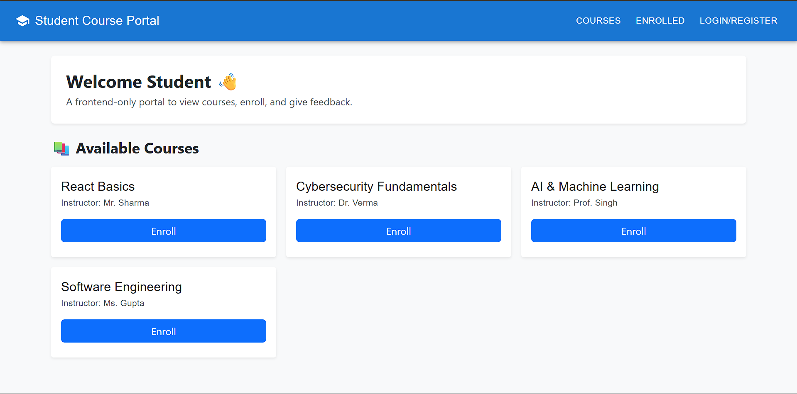
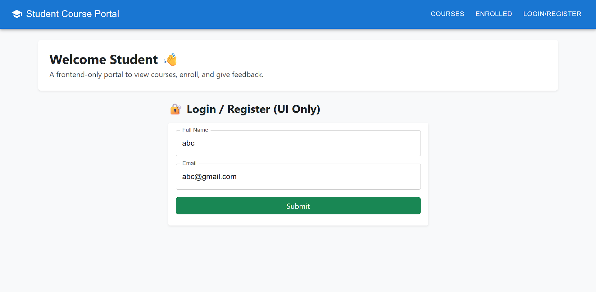
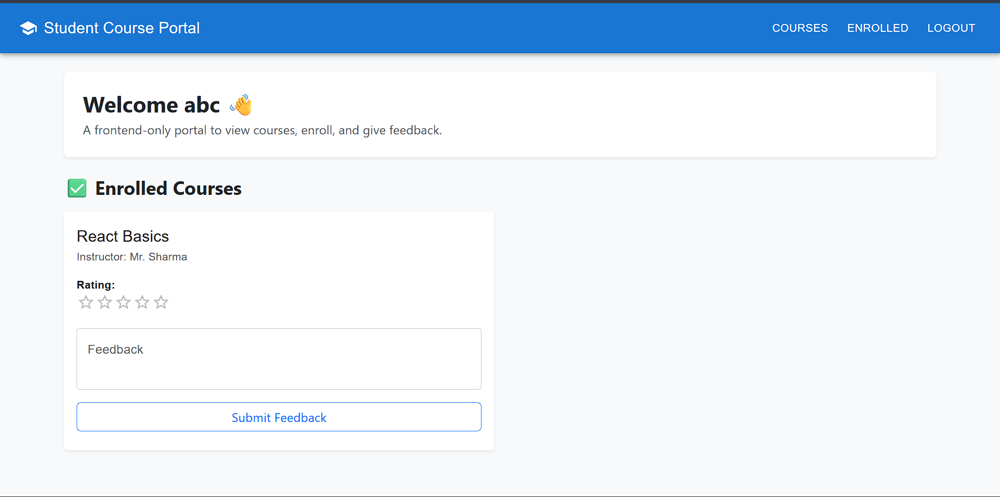

# 🎓 Student Course Management Portal (Frontend Only)

A responsive **Single Page Application (SPA)** built using **React + Vite** that allows students to view courses, register/login (UI only), enroll in courses, view enrolled courses, and provide feedback.

This project is **frontend-only** (no backend/database). All data is managed using **React state**.

---

## ✅ Features

- 📚 View available courses  
- 🔐 Register/Login (UI only)  
- ✅ Enroll in courses  
- 📝 View enrolled courses  
- ⭐ Provide rating and feedback  
- 📱 Fully responsive UI  
- 🎨 Uses **Bootstrap + Material UI** components

---

## 🛠️ Tech Stack

- **React (Vite)**
- **Bootstrap 5**
- **Material UI (MUI)**
- JavaScript (ES6)

---

## 📸 Screenshots

### 🔹 Home / Courses Page


### 🔹 Login / Register Page


### 🔹 Enrolled Courses + Feedback Page


---

## 📂 Project Structure

```

student-portal/
│── src/
│   ├── App.jsx
│   ├── main.jsx
│── public/
│── ss1.png
│── ss2.png
│── ss3.png
│── package.json
│── README.md

````

---

## ⚙️ Installation & Setup

Follow the steps below to run this project locally:

### 1️⃣ Clone the Repository
```bash
git clone <your-repo-link>
cd student-portal
````

### 2️⃣ Install Dependencies

```bash
npm install
```

### 3️⃣ Start Development Server

```bash
npm run dev
```

The app will run at:

```
http://localhost:5173/
```

---

## 📌 How the App Works (Frontend Logic)

* Courses are stored in a static array (`courseList`)
* Login/Register is UI-based and stores user info using React state
* Enrolled courses are stored in an `enrolled` array state
* Feedback and rating are stored inside each enrolled course object
* Navigation works using a `page` state variable (SPA without React Router)

---

## 🚀 Future Improvements

* Add React Router for real page routes
* Add backend integration (Node/Express + MongoDB)
* Add authentication with JWT
* Store enrolled courses and feedback in database

---

