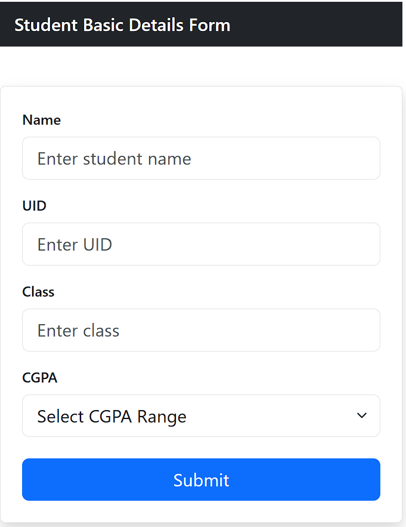

# 📝 Student Basic Details Form (React)

A simple and clean **Student Basic Details Form** built using **React JS** and styled with **Bootstrap**.  
This project contains a centered form UI that collects basic student information such as **Name, UID, Class, and CGPA range**.

---

## 🚀 Features

✅ Responsive Navbar at the top  
✅ Centered Student Form UI  
✅ Input fields for:
- Name  
- UID  
- Class  
✅ CGPA range dropdown selection  
✅ Submit button with full width style  
✅ Modern UI using Bootstrap + shadow card styling  

---

## 🖼️ Screenshot

Project Output:



---

## 🛠️ Tech Stack Used

- **React JS**
- **Bootstrap**
- **JavaScript**
- **CSS**

---

## 📂 Project Structure

```

src/
│── App.jsx
│── ss.png

````

---

## ▶️ How to Run This Project

### 1️⃣ Clone the Repository
```bash
git clone <your-repo-link>
````

### 2️⃣ Open Project Folder

```bash
cd your-project-folder
```

### 3️⃣ Install Dependencies

```bash
npm install
```

### 4️⃣ Start Development Server

```bash
npm run dev
```

---

## 📌 Form Fields Included

🔹 **Name** (text input)
🔹 **UID** (text input)
🔹 **Class** (text input)
🔹 **CGPA Range** (dropdown menu)
🔹 **Submit Button**

---

## ✅ Author

👤 **Your Name Here**
📌 React Mini Project

