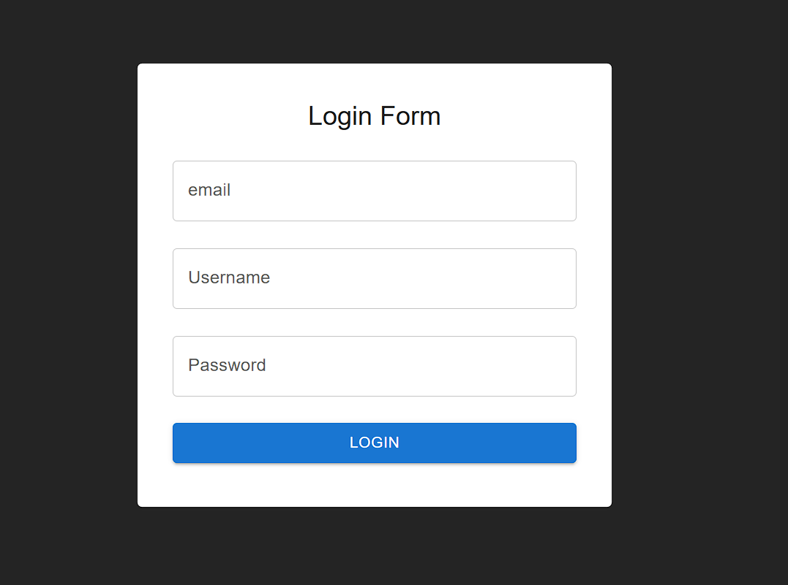

# 🔐 Login Form (React + Material UI)

A simple and responsive **Login Form UI** built using **React JS** and **Material UI (MUI)**.  
This project displays a clean login card with input fields for **Email, Username, and Password**, along with a login button.

---

## 🚀 Features

✅ Modern UI built with **Material UI (MUI)**  
✅ Input Fields:
- Email
- Username
- Password  
✅ Responsive Card layout  
✅ Clean and minimal design  
✅ Fully centered form on screen  

---

## 🖼️ Screenshots

### ✅ 1) Login Form (Empty)


### ✅ 2) Login Form (Filled)


---

## 🛠️ Tech Stack Used

- **React JS**
- **Material UI (MUI)**
- **JavaScript**
- **CSS**

---

## 📂 Project Structure

```

src/
│── App.jsx
│── App.css
│── ss.png
│── ss2.png

````

---

## ▶️ How to Run This Project

### 1️⃣ Clone the Repository
```bash
git clone <your-repo-link>
````

### 2️⃣ Open Project Folder

```bash
cd your-project-folder
```

### 3️⃣ Install Dependencies

```bash
npm install
```

### 4️⃣ Start Development Server

```bash
npm run dev
```

---

## 📌 UI Components Used (MUI)

* **Card**
* **CardContent**
* **Typography**
* **TextField**
* **Button**

---

## ✅ Author

👤 **Your Name Here**
📌 React Mini Project


