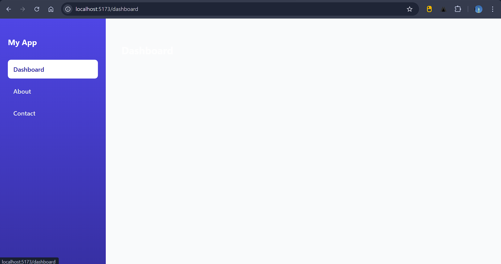

## Aim
To implement basic client-side routing in a Single Page Application using React Router.

## Application Description
The application implements a sidebar layout with navigation links for:

- Dashboard
- About
- Contact

Each link updates the URL and displays the respective page content without reloading the browser.

The default route redirects to the Dashboard page.

---

## Routing Paths

| Route | Description |
|-------|-------------|
| `/` | Redirects to Dashboard |
| `/dashboard` | Displays Dashboard page |
| `/about` | Displays About page |
| `/contact` | Displays Contact page |

Example URLs:

```

[http://localhost:5173/dashboard]
[http://localhost:5173/about]
[http://localhost:5173/contact]

```

---

## Screenshot



---

## Project Structure

```

src/
│
├── App.jsx        # Main layout and routes
├── main.jsx       # Entry point with BrowserRouter
├── App.css        # Layout styling
├── index.css      # Global styles
└── assets/

```

---

## How to Run the Project

### Install dependencies
```

npm install

```

### Start development server
```

npm run dev

```

### Open browser
```

[http://localhost:5173]

```

---

## Result
Basic client-side routing using React Router was successfully implemented, allowing navigation between multiple pages without reloading the application.

---

## Conclusion
This experiment demonstrates how routing works in a React SPA using React Router, improving user experience by enabling seamless navigation.

---


