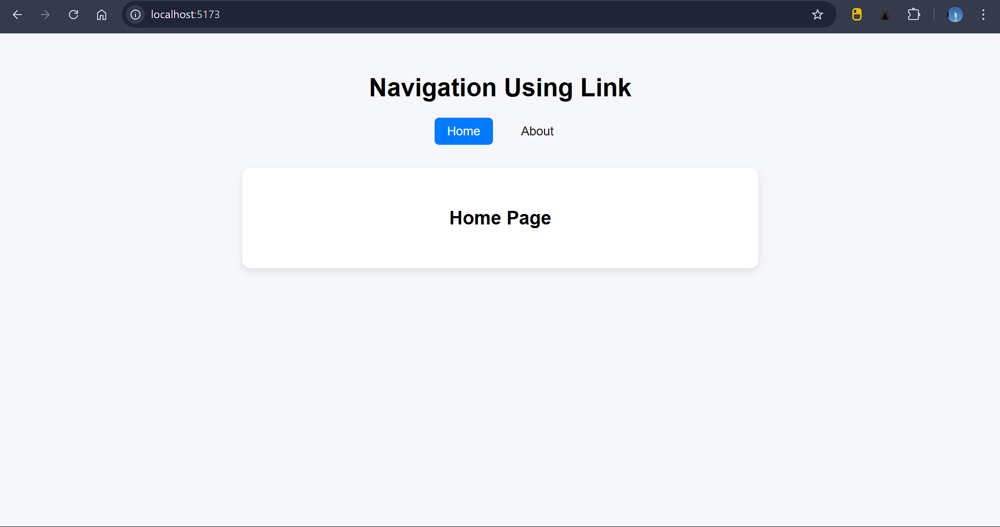
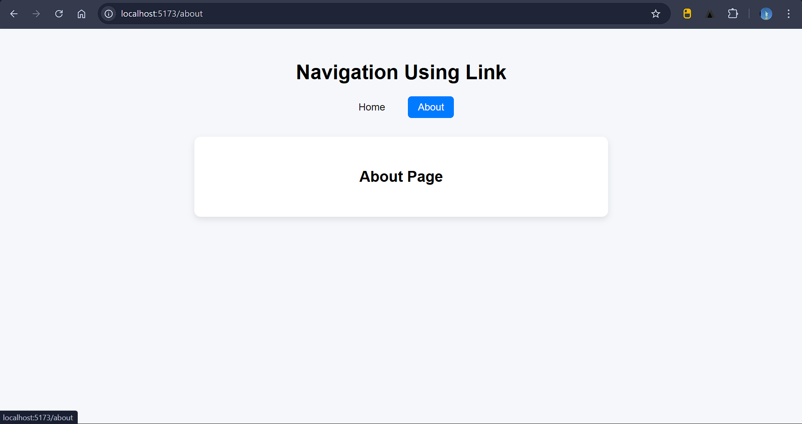

## Aim
To implement navigation links in a Single Page Application (SPA) using the **React Router `Link` component**.

---

## Description
This project demonstrates basic navigation between pages in a React application using **React Router DOM**. It includes two pages:

- Home Page
- About Page

Navigation is handled without page reloads, providing smooth SPA routing behavior. The active navigation link is highlighted based on the current route.

---

## Features
- SPA navigation using React Router
- `Link` component for navigation
- Active link highlighting
- Separate page components
- Clean layout with navigation bar

---

## Technologies Used
- React
- React Router DOM
- Vite (development server)
- CSS for styling

---

## Project Structure
```

src/
│
├── Pages/
│   ├── Home.jsx
│   └── About.jsx
│
├── App.jsx
├── main.jsx
├── App.css
└── index.css

````

---

## Routing Overview
| Route | Component | Description |
|-------|-----------|-------------|
| `/` | Home | Displays Home page |
| `/about` | About | Displays About page |

---

## Main Routing Logic
Navigation is handled using:

```jsx
<Link to="/">Home</Link>
<Link to="/about">About</Link>
````

Routes are defined using:

```jsx
<Routes>
  <Route path="/" element={<Home />} />
  <Route path="/about" element={<About />} />
</Routes>
```

---

## Installation & Setup

1. Clone the repository or copy the project.
2. Install dependencies:

   ```bash
   npm install
   ```
3. Start development server:

   ```bash
   npm run dev
   ```
4. Open in browser:

   ```
   http://localhost:5173
   ```

---

## Output Screenshots

### Home Page



### About Page




---

## Conclusion

This experiment successfully demonstrates navigation in a React SPA using the React Router `Link` component and route configuration.

---
