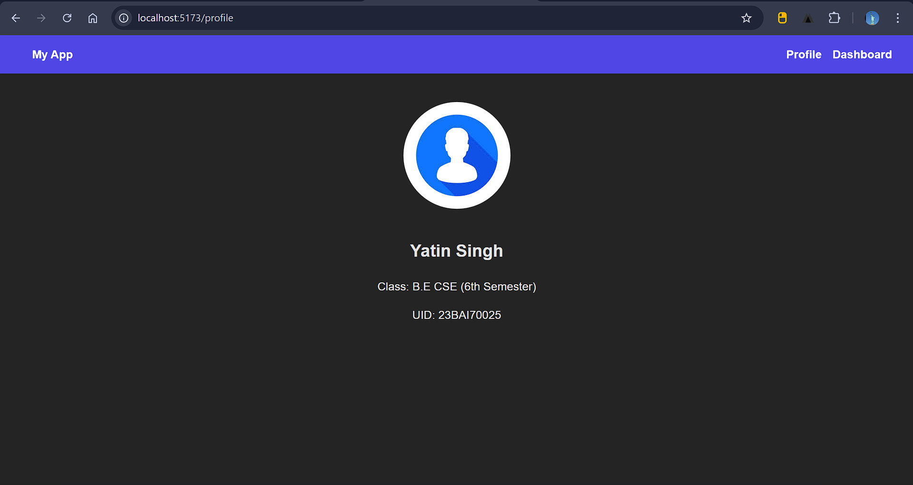
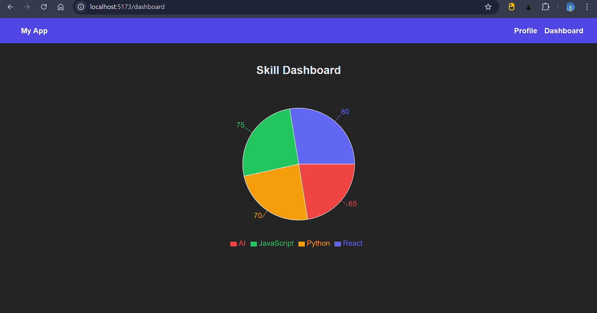

## Aim
To create a multi-page Single Page Application (SPA) using client-side routing.

---

## Description
This project demonstrates a **multi-page SPA built with React** using **React Router** for navigation between pages without reloading the browser.

The application contains:
- A Profile Page
- A Skill Dashboard Page
- Navigation via a top navbar
- A Pie Chart visualization for skills using Recharts

---

## Features
- Client-side routing using React Router
- Profile page with user information
- Dashboard page with skill visualization
- Responsive layout
- Navigation bar for switching pages
- Pie chart visualization using Recharts

---

## Technologies Used
- React
- React Router DOM
- Recharts
- CSS
- Vite

---

## Project Structure
```

exp3.3/
│
├── node_modules/
├── public/
├── src/
│   ├── assets/
│   ├── App.css
│   ├── App.jsx
│   ├── index.css
│   ├── main.jsx
│   └── pfp.jpg
│
├── ss.png
├── ss2.png
├── README.md
├── index.html
├── package.json
├── vite.config.js
└── ...

````

---

## Procedure
1. Create multiple components.
2. Map each component to a route.
3. Test navigation.

---

## Installation & Setup

### Clone repository
```bash
git clone <repository-url>
cd exp3.3
````

### Install dependencies

```bash
npm install
```

### Install required libraries

```bash
npm install react-router-dom recharts
```

### Run development server

```bash
npm run dev
```

Open:

```
http://localhost:5173
```

---

## Routing Configuration

Routes used:

* `/` → Profile Page
* `/profile` → Profile Page
* `/dashboard` → Skill Dashboard

Navigation handled using React Router `Link`.

---

## Screenshots

### Profile Page



### Dashboard Page



---

## Skill Dashboard Data

| Skill      | Score |
| ---------- | ----- |
| React      | 80    |
| JavaScript | 75    |
| Python     | 70    |
| AI         | 65    |

---

## Future Improvements

* Authentication system
* Editable profile data
* Backend integration
* Dynamic data storage
* Additional visual analytics

---


## Conclusion

This experiment successfully demonstrates routing in React to build a multi-page SPA with smooth navigation and visual data representation.
