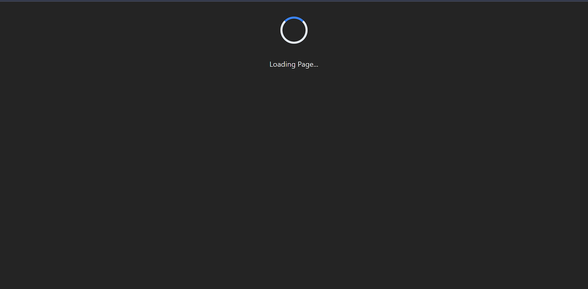
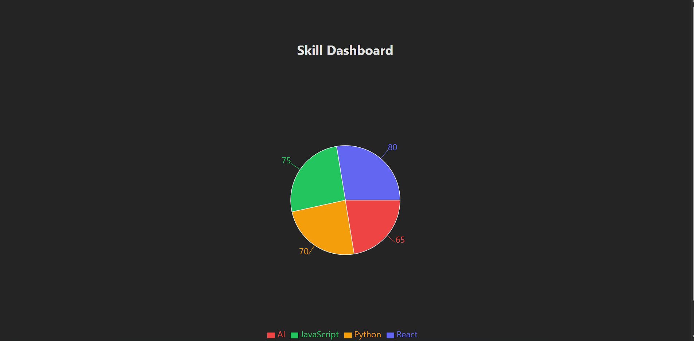

# 📊 Skill Dashboard (React + Recharts)

A simple **React Dashboard** that displays skills using a **Pie Chart** built with Recharts.
This project also demonstrates **lazy loading** using `React.lazy()` and `Suspense` for better performance.

---

## 📸 Dashboard Preview

### ⏳ ss2 – Lazy Loading Screen (Spinner Visible)



This screen appears first when the Dashboard component is being loaded lazily.
A spinner loader is displayed using **React Suspense fallback**.

### 📊 ss – Skill Dashboard UI



After lazy loading completes, the dashboard renders a pie chart showing different skill levels.

---

## 🚀 Features

* ⚛️ Built with React + Vite
* 📈 Interactive Pie Chart using Recharts
* 🎯 Skill visualization dashboard
* 💤 Lazy Loading with React Suspense
* 🎨 Responsive layout

---

## 🛠️ Tech Stack

* React
* Vite
* Recharts
* JavaScript (ES6+)
* CSS

---

## 📂 Project Structure

```
src/
│
├── Component/
│   └── Dashboard.jsx
│
├── App.jsx
├── main.jsx
└── App.css
```

---

## 📦 Installation & Setup

### 1️⃣ Clone the repository

```
git clone https://github.com/yatinsingh825/full_stack.git
```

### 2️⃣ Navigate to project folder

```
cd full_stack
```

### 3️⃣ Install dependencies

```
npm install
```

### 4️⃣ Install Recharts (if not installed)

```
npm install recharts
```

### 5️⃣ Run the project

```
npm run dev
```

---

## 📊 Dashboard Details

The dashboard displays a pie chart representing skill levels:

* React
* JavaScript
* Python
* AI

---

## ⚡ Lazy Loading

The `Dashboard` component is loaded using:

```js
const Dashboard = lazy(() => import("./Component/Dashboard"));
```

This improves performance by loading the component only when needed.
During loading, **ss2.png** shows the spinner, and once finished **ss.png** displays the dashboard.

---

## 🎯 Learning Goals

This project demonstrates:

* Data visualization in React
* Code splitting with lazy loading
* Responsive chart design
* Component-based structure

---
