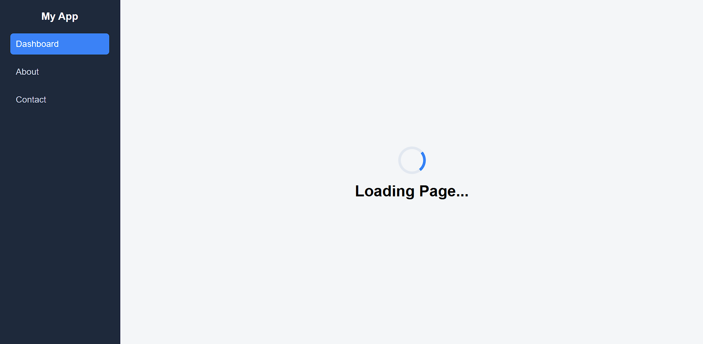
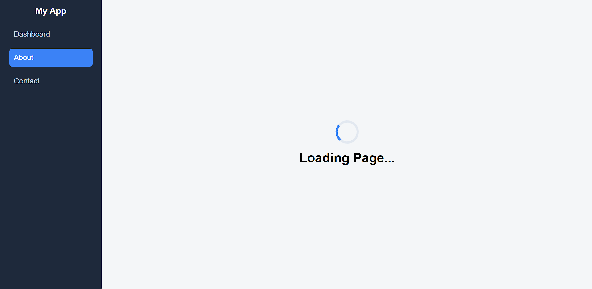
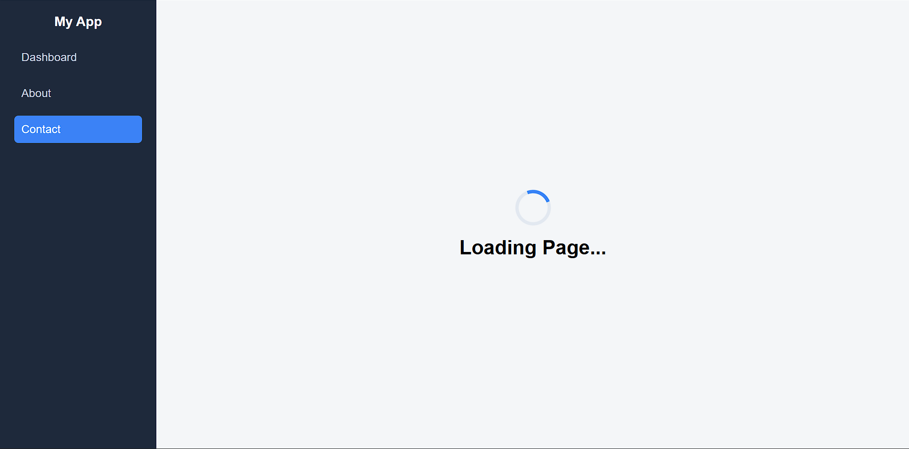

# 🚀 Experiment 5.2 – Route-Based Lazy Loading in React SPA

## 📌 Overview

This project demonstrates **Route-Based Lazy Loading** in a Single Page Application (SPA) using **React** and **React Router DOM**.
Lazy loading improves performance by loading components only when a user navigates to a specific route instead of loading everything at startup.

---

## 🎯 Aim

To implement route-based lazy loading to improve performance and reduce initial bundle size in a React Single Page Application.

---

## 📚 Theory

Lazy loading is a performance optimization technique where components are loaded dynamically when required.

In React:

* `React.lazy()` is used for dynamic imports.
* `Suspense` shows a fallback loader while components load.

In this experiment, a **3-second artificial delay** is added to clearly demonstrate lazy loading behavior using a custom spinner loader.

---

## ⚙️ Technologies Used

* React (Vite)
* React Router DOM
* JavaScript (ES6)
* CSS3

---

## 🛠️ Features

* Sidebar navigation (Dashboard, About, Contact)
* Route-based lazy loading
* Custom animated loader spinner
* Artificial delay (~3 sec)
* Active navigation highlighting
* Clean modern UI layout

---

## 📂 Project Structure

```
src/
│
├── App.jsx
├── main.jsx
├── App.css
│
├── pages/
│   ├── Home.jsx
│   ├── About.jsx
│   └── Contact.jsx
│
└── components/
    └── Loader.jsx
```

---

## 🔄 Working

1. User clicks a route from sidebar.
2. Component loads lazily using `React.lazy()`.
3. Loader spinner appears for 3 seconds.
4. Selected page renders after loading completes.

---

## 🧪 Screenshots

### ⏳ ss1 – Lazy Loading Screen of Dashboard



Displays the spinner loader while the Dashboard component is being loaded lazily.

### ✅ ss2 – Dashboard Page Rendered


Shows the Dashboard after lazy loading completes successfully.

---
### ⏳ ss3 – Lazy Loading Screen of about



Displays the spinner loader while the About component is being loaded lazily.

### ✅ ss4 – About Page Rendered


Shows the About after lazy loading completes successfully.

---
### ⏳ ss5 – Lazy Loading Screen



Displays the spinner loader while the Contact component is being loaded lazily.

### ✅ ss6 – Contact Page Rendered


Shows the Contact after lazy loading completes successfully.

---


## ▶️ How to Run the Project

### 1️⃣ Install Dependencies

```
npm install
```

### 2️⃣ Install Router (if needed)

```
npm install react-router-dom
```

### 3️⃣ Start Development Server

```
npm run dev
```

---

## 📈 Result

Route-based lazy loading was successfully implemented.
The application loads faster initially and components render only when required, improving performance and user experience.

---
