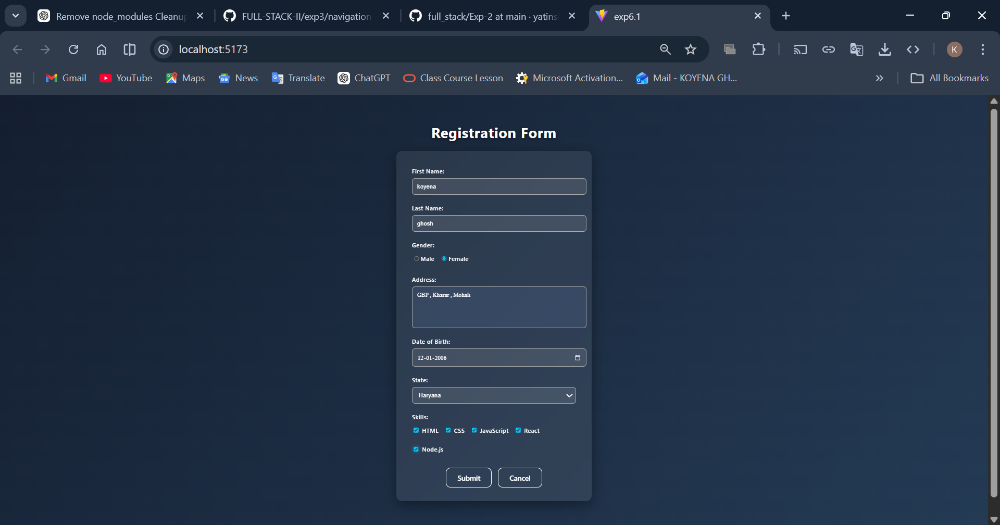
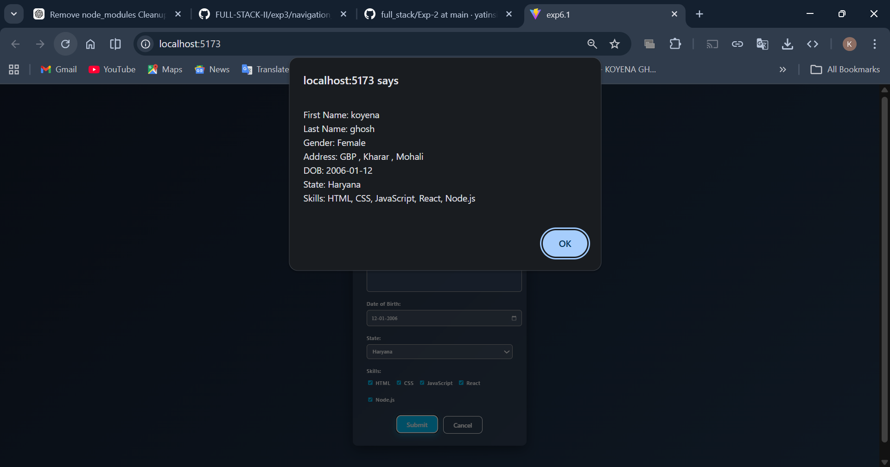

# 📝 React Controlled Components – Registration Form

This project demonstrates **handling forms using controlled components in React**.
All form fields are managed using React state (`useState`) and the submitted data is displayed using an alert popup.

---

## 📌 Features

* Controlled Form Inputs using React State
* Text Fields (First Name, Last Name)
* Gender Selection (Radio Buttons)
* Address Input (Textarea)
* Date of Birth with **future date restriction**
* State Selection (Dropdown)
* Skills Selection (Checkboxes)
* Submit and Cancel (Reset) Functionality
* Alert summary of entered details

---

## 🛠️ Tech Stack

* React (Vite)
* JavaScript (ES6+)
* CSS3

---

## 📷 Screenshots

### ✅ Filled Registration Form



### ✅ Alert Showing Submitted Details



---

## ⚙️ Installation & Setup

1. Clone the repository:

```bash
git clone <your-repo-link>
```

2. Navigate into the project folder:

```bash
cd project-folder
```

3. Install dependencies:

```bash
npm install
```

4. Start development server:

```bash
npm run dev
```

---

## 🧠 Learning Outcomes

* Understanding Controlled Components in React
* Managing multiple inputs with a single state object
* Handling radio buttons, checkboxes, dropdowns, and date inputs
* Form submission handling using event handlers
* Resetting form using state management

---
