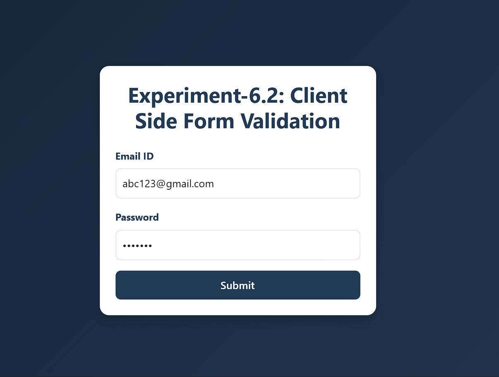
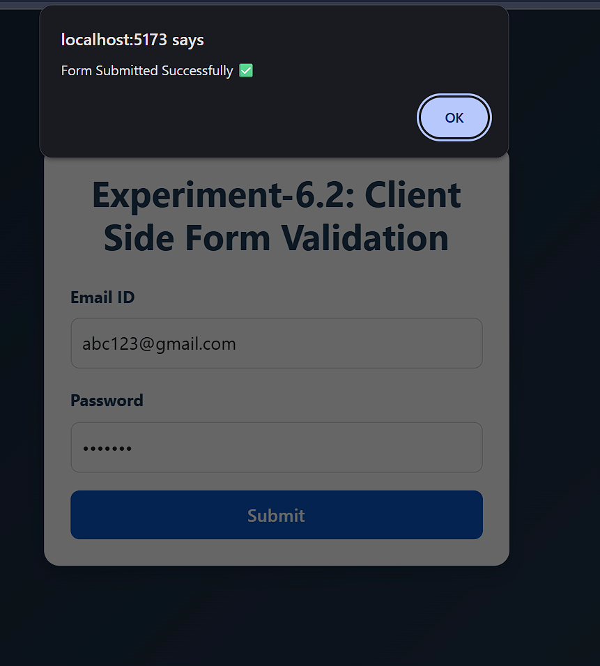
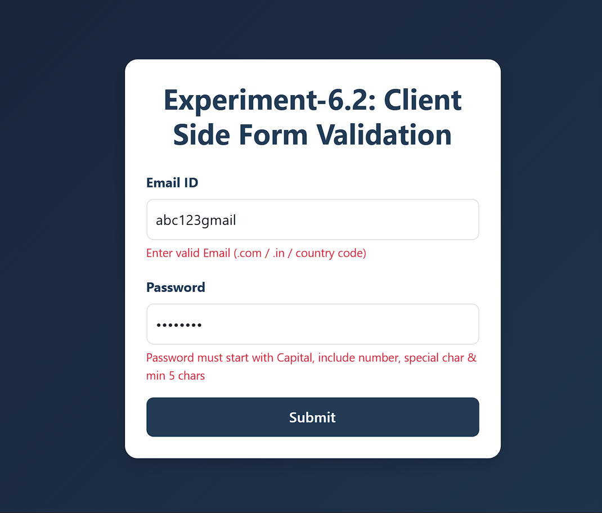
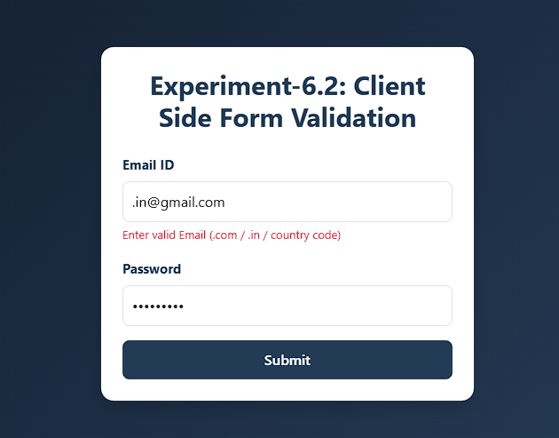
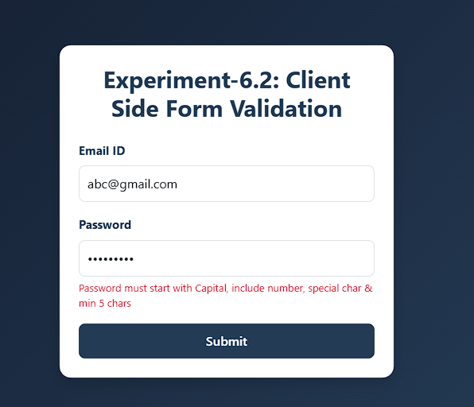

# 🧪 Experiment-2: Client Side Form Validation (React + Vite + Bootstrap)

This project demonstrates **client-side form validation** using React.
The form validates **Email ID** and **Password** before allowing submission.

---

## 🎯 Aim

To validate form inputs on the client side before submission using React.

---

## 📖 Theory

Client-side validation ensures correctness of user data and provides immediate feedback without server interaction. It improves user experience by preventing invalid data from being submitted.

---

## ⚙️ Technologies Used

* React (Vite)
* Bootstrap 5
* JavaScript (Regex Validation)
* CSS

---

## 🧩 Validation Rules

### ✅ Email ID

* Must contain `@`
* Must include valid domain like `.com`, `.in`, or country code

### ✅ Password

* Must start with a **capital letter**
* Must contain **at least one number**
* Must contain **at least one special character**
* Minimum **5 characters**

---

## 🚀 Features

* Client-side validation using regex
* Error messages for invalid inputs
* Success alert on valid submission
* Bootstrap styled responsive UI

---

## 📸 Screenshots

### ✅ ss1.png — Form filled with correct details



### 🎉 ss2.png — Alert message after successful submission



### ❌ ss3.png — Error messages for invalid inputs



---

### ❌ ss4.png — Error messages for invalid Gmail



---

### ❌ ss5.png — Error messages for invalid password



---

## ▶️ How to Run

```bash
npm install
npm run dev
```

---

## 📂 Project Structure

```
src/
 ├── App.jsx
 ├── App.css
 └── main.jsx
```

---

## 📚 Learning Outcomes

* Understanding client-side form validation
* Using regex for input validation
* Handling form state in React
* Displaying dynamic error messages

---
